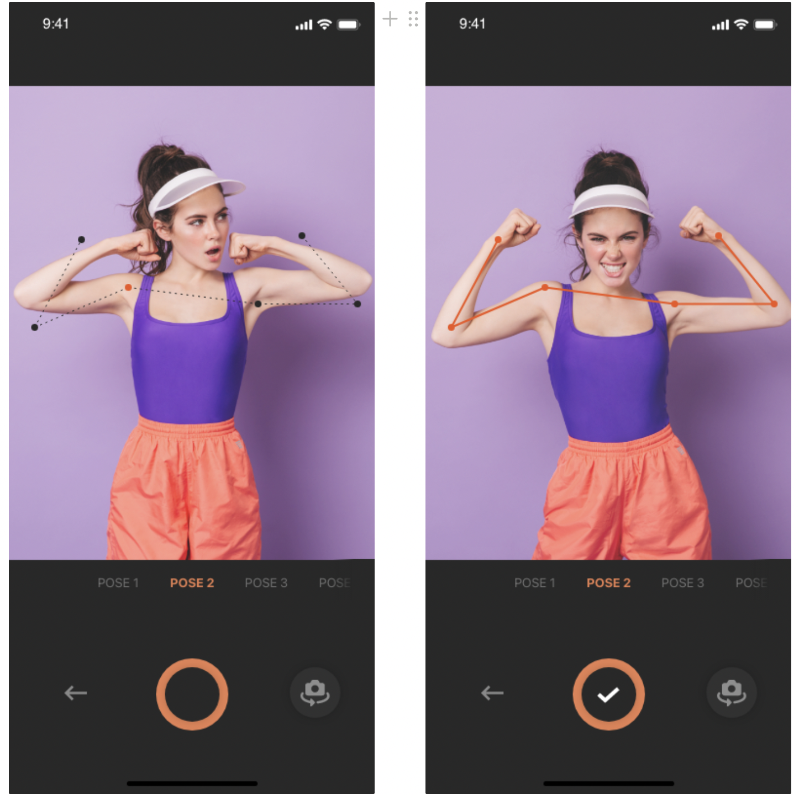

## Pose-detected Camera Project
Implementation of pose-detection model suitable for a pose-detected camera application.
Our additional implementation located in *\demo* and *\docker* folders.  

Project Page is available on [Website](https://buob.io).

### Screen Capture of Android Application 


## Introduction

[](https://mmpose.readthedocs.io/en/latest/?badge=latest)
[](https://github.com/open-mmlab/mmpose/actions)
[](https://codecov.io/gh/open-mmlab/mmpose)
[](https://pypi.org/project/mmpose/)
[](https://github.com/open-mmlab/mmpose/blob/master/LICENSE)
[](https://github.com/open-mmlab/mmpose/issues)
[](https://github.com/open-mmlab/mmpose/issues)

MMPose is an open-source toolbox for pose estimation based on PyTorch.
It is a part of the [OpenMMLab project](https://github.com/open-mmlab).

The master branch works with **PyTorch 1.3+**.

<div align="center">
    <br>
    COCO 17-keypoint pose estimation
</div>
<div align="center">
<br>

133-keypoint whole-body pose estimation ([full HD version](https://www.youtube.com/watch?v=pIJpQg8mXUU))

</div>

### Major Features

- **Support diverse tasks**

  We support a wide spectrum of mainstream human pose analysis tasks in current research community, including 2d multi-person human pose estimation, 2d hand pose estimation, 2d face landmark detection, 133 keypoint whole-body human pose estimation, fashion landmark detection and 3d human mesh recovery.

- **Higher efficiency and higher accuracy**

  MMPose implements multiple state-of-the-art (SOTA) deep learning models, including both top-down & bottom-up approaches. We achieve faster training speed and higher accuracy than other popular codebases, such as [HRNet](https://github.com/leoxiaobin/deep-high-resolution-net.pytorch).
  See [benchmark.md](docs/benchmark.md) for more information.

- **Support for various datasets**

  The toolbox directly supports multiple popular and representative datasets, COCO, AIC, MPII, MPII-TRB, OCHuman etc.
  See [data_preparation.md](docs/data_preparation.md) for more information.

- **Well designed, tested and documented**

  We decompose MMPose into different components and one can easily construct a customized
  pose estimation framework by combining different modules.
  We provide detailed documentation and API reference, as well as unittests.

## [Model Zoo](https://mmpose.readthedocs.io/en/latest/modelzoo.html)

Supported algorithms:

<details open>
<summary>(click to collapse)</summary>

- [x] [HRNet](configs/top_down/hrnet/README.md) (CVPR'2019)
- [x] [HRNetv2](configs/face/hrnetv2/README.md) (TPAMI'2019)

</details>

Supported [datasets](https://mmpose.readthedocs.io/en/latest/datasets.html):

<details open>
<summary>(click to collapse)</summary>

- [x] [COCO](http://cocodataset.org/) (ECCV'2014)
- [x] [COCO-WholeBody](https://github.com/jin-s13/COCO-WholeBody/) (ECCV'2020)
- [x] [MPII](http://human-pose.mpi-inf.mpg.de/) (CVPR'2014)
- [x] [MPII-TRB](https://github.com/kennymckormick/Triplet-Representation-of-human-Body) (ICCV'2019)
- [x] [AI Challenger](https://github.com/AIChallenger/AI_Challenger_2017) (ArXiv'2017)
- [x] [OCHuman](https://github.com/liruilong940607/OCHumanApi) (CVPR'2019)
- [x] [CrowdPose](https://github.com/Jeff-sjtu/CrowdPose) (CVPR'2019)
- [x] [PoseTrack18](https://posetrack.net/users/download.php) (CVPR'2018)
- [x] [MHP](https://lv-mhp.github.io/dataset) (ACM MM'2018)
- [x] [sub-JHMDB](http://jhmdb.is.tue.mpg.de/dataset) (ICCV'2013)
- [x] [OneHand10K](https://www.yangangwang.com/papers/WANG-MCC-2018-10.html) (TCSVT'2019)
- [x] [FreiHand](https://lmb.informatik.uni-freiburg.de/projects/freihand/) (ICCV'2019)
- [x] [CMU Panoptic HandDB](http://domedb.perception.cs.cmu.edu/handdb.html) (CVPR'2017)
- [x] [InterHand2.6M](https://mks0601.github.io/InterHand2.6M/) (ECCV'2020)
- [x] [Human3.6M](http://vision.imar.ro/human3.6m/description.php) (TPAMI'2014)
- [x] [DeepFashion](http://mmlab.ie.cuhk.edu.hk/projects/DeepFashion/LandmarkDetection.html) (CVPR'2016)
- [x] [300W](https://ibug.doc.ic.ac.uk/resources/300-W/) (IMAVIS'2016)
- [x] [WFLW](https://wywu.github.io/projects/LAB/WFLW.html) (CVPR'2018)
- [x] [AFLW](https://www.tugraz.at/institute/icg/research/team-bischof/lrs/downloads/aflw/) (ICCVW'2011)
- [x] [COFW](http://www.vision.caltech.edu/xpburgos/ICCV13/) (ICCV'2013)

</details>

Supported backbones:

<details>
<summary>(click to expand)</summary>

- [x] [AlexNet](configs/top_down/alexnet/README.md) (NeurIPS'2012)
- [x] [VGG](configs/top_down/vgg/README.md) (ICLR'2015)
- [x] [HRNet](configs/top_down/hrnet/README.md) (CVPR'2019)
- [x] [ResNet](configs/top_down/resnet/README.md) (CVPR'2016)
- [x] [ResNetV1D](configs/top_down/resnetv1d/README.md) (CVPR'2019)
- [x] [ResNeSt](configs/top_down/resnest/README.md) (ArXiv'2020)
- [x] [ResNext](configs/top_down/resnext/README.md) (CVPR'2017)
- [x] [SCNet](configs/top_down/scnet/README.md) (CVPR'2020)
- [x] [SEResNet](configs/top_down/seresnet/README.md) (CVPR'2018)
- [x] [ShufflenetV1](configs/top_down/shufflenet_v1/README.md) (CVPR'2018)
- [x] [ShufflenetV2](configs/top_down/shufflenet_v2/README.md) (ECCV'2018)
- [x] [MobilenetV2](configs/top_down/mobilenet_v2/README.md) (CVPR'2018)

</details>

Results and models are available in the *README.md* of each method's config directory.
A summary can be found in the [**model zoo**](https://mmpose.readthedocs.io/en/latest/modelzoo.html) page.
We will keep up with the latest progress of the community, and support more popular algorithms and frameworks.

If you have any feature requests, please feel free to leave a comment in [Issues](https://github.com/open-mmlab/mmpose/issues/9).

## Benchmark

We demonstrate the superiority of our MMPose framework in terms of speed and accuracy on the standard COCO keypoint detection benchmark.

| Model | Input size| MMPose (s/iter) | [HRNet](https://github.com/leoxiaobin/deep-high-resolution-net.pytorch) (s/iter) | MMPose (mAP) | [HRNet](https://github.com/leoxiaobin/deep-high-resolution-net.pytorch) (mAP) |
| :--- | :---------------: | :---------------: |:--------------------: | :----------------------------: | :-----------------: |
| hrnet_w32  | 256x192  | **0.54** | 1.31 | **0.746** | 0.744 |
| hrnet_w32  | 384x288  | **0.76** | 2.00 | **0.760** | 0.758 |
| hrnet_w48  | 256x192  | **0.66** | 1.55 | **0.756** | 0.751 |
| hrnet_w48  | 384x288  | **1.23** | 2.20 | **0.767** | 0.763 |

More details about the benchmark are available on [benchmark.md](docs/benchmark.md).

## Installation

Please refer to [install.md](docs/install.md) for installation.

## Data Preparation

Please refer to [data_preparation.md](docs/data_preparation.md) for a general knowledge of data preparation.

## Get Started

Please see [getting_started.md](docs/getting_started.md) for the basic usage of MMPose.
There are also tutorials:

- [learn about configs](docs/tutorials/0_config.md)
- [finetune model](docs/tutorials/1_finetune.md)
- [add new dataset](docs/tutorials/2_new_dataset.md)
- [customize data pipelines](docs/tutorials/3_data_pipeline.md)
- [add new modules](docs/tutorials/4_new_modules.md)
- [export a model to ONNX](docs/tutorials/5_export_model.md)
- [customize runtime settings](docs/tutorials/6_customize_runtime.md)

## License

This project is released under the [Apache 2.0 license](LICENSE).

## Citation

If you find this project useful in your research, please consider cite:

```bibtex
@misc{mmpose2020,
    title={OpenMMLab Pose Estimation Toolbox and Benchmark},
    author={MMPose Contributors},
    howpublished = {\url{https://github.com/open-mmlab/mmpose}},
    year={2020}
}
```

## Contributing

We appreciate all contributions to improve MMPose. Please refer to [CONTRIBUTING.md](.github/CONTRIBUTING.md) for the contributing guideline.

## Acknowledgement

MMPose is an open source project that is contributed by researchers and engineers from various colleges and companies.
We appreciate all the contributors who implement their methods or add new features, as well as users who give valuable feedbacks.
We wish that the toolbox and benchmark could serve the growing research community by providing a flexible toolkit to reimplement existing methods and develop their own new models.

## Projects in OpenMMLab

- [MMCV](https://github.com/open-mmlab/mmcv): OpenMMLab foundational library for computer vision.
- [MMClassification](https://github.com/open-mmlab/mmclassification): OpenMMLab image classification toolbox and benchmark.
- [MMDetection](https://github.com/open-mmlab/mmdetection): OpenMMLab detection toolbox and benchmark.
- [MMDetection3D](https://github.com/open-mmlab/mmdetection3d): OpenMMLab's next-generation platform for general 3D object detection.
- [MMSegmentation](https://github.com/open-mmlab/mmsegmentation): OpenMMLab semantic segmentation toolbox and benchmark.
- [MMAction2](https://github.com/open-mmlab/mmaction2): OpenMMLab's next-generation action understanding toolbox and benchmark.
- [MMTracking](https://github.com/open-mmlab/mmtracking): OpenMMLab video perception toolbox and benchmark.
- [MMPose](https://github.com/open-mmlab/mmpose): OpenMMLab pose estimation toolbox and benchmark.
- [MMEditing](https://github.com/open-mmlab/mmediting): OpenMMLab image and video editing toolbox.
